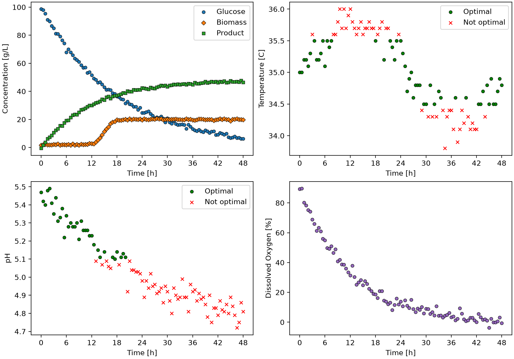

# Fermentation Process Analysis 

An automated Python tool to monitor fermentation batch conditions, verify operating limits, and export diagnostic dashboards and quality summary reports

## Overview

Fermentation processes require continuous monitoring to ensure operating conditions such as pH and temperature stay within acceptable limits, since these variables strongly influence cell growth and productivity. Manually checking whether every measurement across dozens of batches falls within range is tedious and error-prone. This project automates that analysis, producing clear visual dashboards and summary tables that make it easy to assess how well each batch was controlled.

## Features

- Extracts time-series data for individual fermentation batches from a CSV dataset
- Identifies pH and temperature measurements that fall outside acceptable operating ranges
- Generates multi-panel dashboard figures for each batch, visualizing substrate/biomass/product concentrations, temperature, pH, and dissolved oxygen over time
- Flags out-of-range pH and temperature measurements directly on the figures
- Exports summary tables reporting the percentage of in-range measurements and final product concentration for every batch

## Technologies Used

- Python 3.14.7
- pandas 3.0.5
- matplotlib 3.11.0

## Code Design
Running `main.py` creates a `BioprocessMonitor` instance for two different operating modes, each with its own acceptable pH and temperature ranges. For every batch in the dataset, the script generates a dashboard figure showing glucose/biomass/product concentration, temperature, pH, and dissolved oxygen over time. It also exports a summary CSV table per mode, reporting the percentage of time each batch operated within its acceptable ranges.

## Dashboard

This dashboard summarizes a single fermentation batch across four panels:
- **Top-Left**: Tracks glucose consumption alongside biomass and product accumulation over time.
- **Top-Right & Bottom-Left**: Show temperature and pH respectively, with measurements inside the acceptable operating range marked as **green circles** and out-of-range measurements marked as **red X's**, making it easy to spot when corrective action would have been needed.
- **Bottom-Right**: Shows dissolved oxygen declining as the culture

## Summary Table

|batch_id|ph_optimal_percent|temperature_optimal_percent|C_product_g_L^-1_final|
|--------|------------------|---------------------------|----------------------|
|1       |93.81             |97.94                      |46.5                  |
|2       |96.69             |97.52                      |50.8                  |
|3       |95.89             |93.15                      |44.6                  |
|4       |100               |96.47                      |48.6                  |
|5       |48.62             |99.08                      |24.7                  |

This table summarizes performance across all five batches run under Mode A's operating limits. Most batches spent the majority of their runtime within the acceptable pH and temperature ranges, resulting in consistent final product concentrations. 
Batch 5 stands out with a notably lower pH-optimal percentage (48.62%), which directly corresponds to its lower final product concentration (24.7 g/L), highlighting the link between maintaining optimal operating conditions and overall process performance.